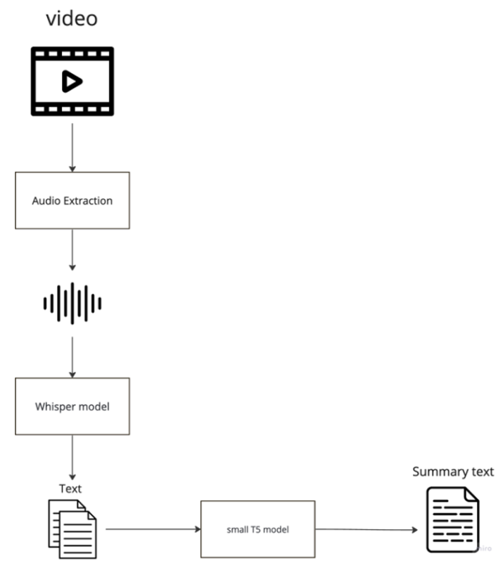
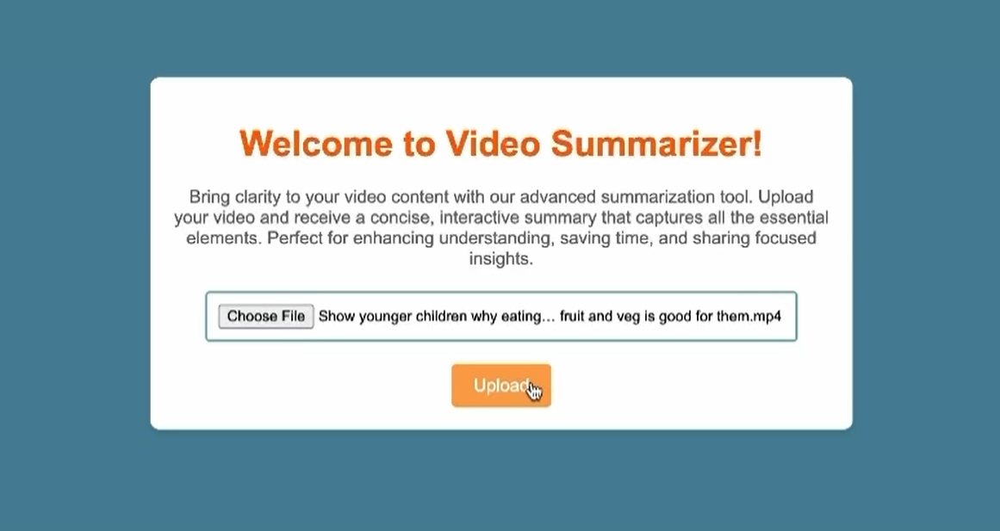
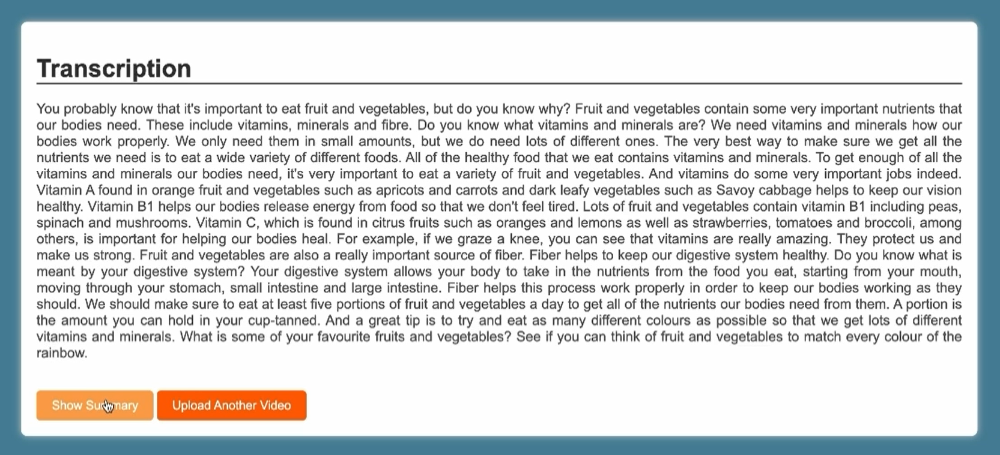
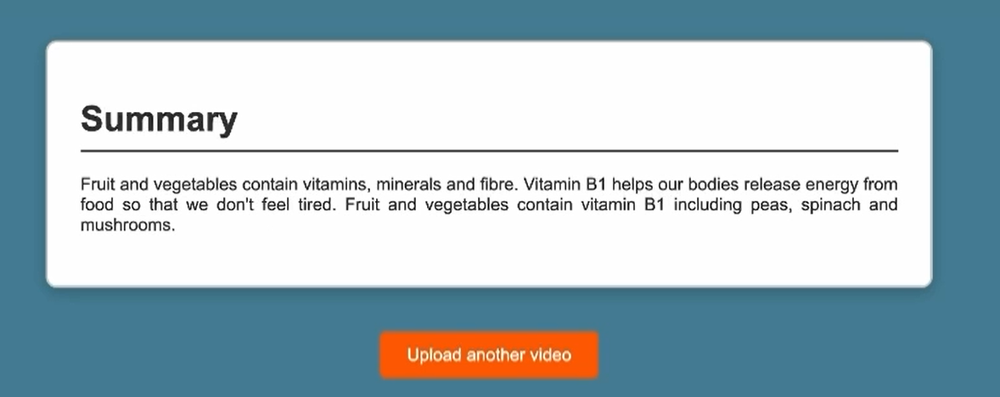

# Video Summarization Web Application

## Overview

In today's fast-paced world, many individuals struggle to find time to watch lengthy videos, which creates a significant gap in information accessibility. This project addresses these challenges by developing a web application that leverages advanced AI technologies to enhance user interaction with video content. Our solution extracts audio from videos, converts it to text using OpenAI's Whisper ASR system, and summarizes this text with a fine-tuned T5 model. This innovative approach not only reduces the time required to consume content but also improves accessibility for individuals with hearing impairments.

## Objectives

- **Problem Statement:** Many people face difficulties in accessing and utilizing video content efficiently, particularly those with hearing impairments.

- **Goal:** To create a web application that provides text-based summaries of video content, making it more manageable and inclusive for a broader audience.

- **Scope:** The application will be web-based and initially support the English language, focusing on accessibility and usability across various devices.

## Features

- **Audio Extraction:** Automatically extracts audio from uploaded video files.

- **Audio-to-Text Conversion:** Converts extracted audio to text using OpenAI's Whisper ASR system.

- **Text Summarization:** Uses the T5-small model to condense transcribed text into concise summaries.

- **User-Friendly Interface:** Allows users to upload videos and receive summarized text in an intuitive format.

  
## Diagram

## Technical Details

### Data Collection and Sources

- Utilizes the CNN/DailyMail dataset for training and evaluating the summarization model. A total of 50,000 data samples were used to train the T5 small model.

### Model Development

1. **Data Pre-processing:** Includes cleaning text data by removing URLs and normalizing whitespace.

2. **Workflow Integration:** Employs a monolithic architecture for seamless data flow between components.

3. **Model Components:**

   - **Video to Audio Conversion:** Uses FFmpeg to extract audio.

   - **Audio Transcription:** Preprocesses audio for clarity and transcribes it using OpenAI's Whisper model.

   - **Text Summarization:** Fine-tunes the T5-small model for generating concise summaries.

### Performance Analysis

The application has been evaluated using metrics such as Word Error Rate (WER), Character Error Rate (CER), ROUGE, BLEU, and METEOR, showcasing its capability in providing accurate transcriptions and summaries.

## Conclusion

In conclusion, our project successfully developed a web application that improves video content accessibility and consumption efficiency. The Whisper ASR system demonstrated high transcription accuracy, with Word Error Rates (WER) ranging from 2.05% to 22.38%. The fine-tuned T5-small model generated concise summaries, achieving ROUGE-1 precision of 27.98% and recall of 36.62%, indicating its capability to capture essential information. While the results are promising, there is room for improvement in precision and recall. Overall, this project highlights the potential of AI-driven solutions to make video content more manageable and inclusive for diverse audiences. Future work will focus on enhancing model performance and expanding language support.

## Demo

**1 -User Video Uploading**

**2- Transcript Generating**

**3- Summary Generating**

